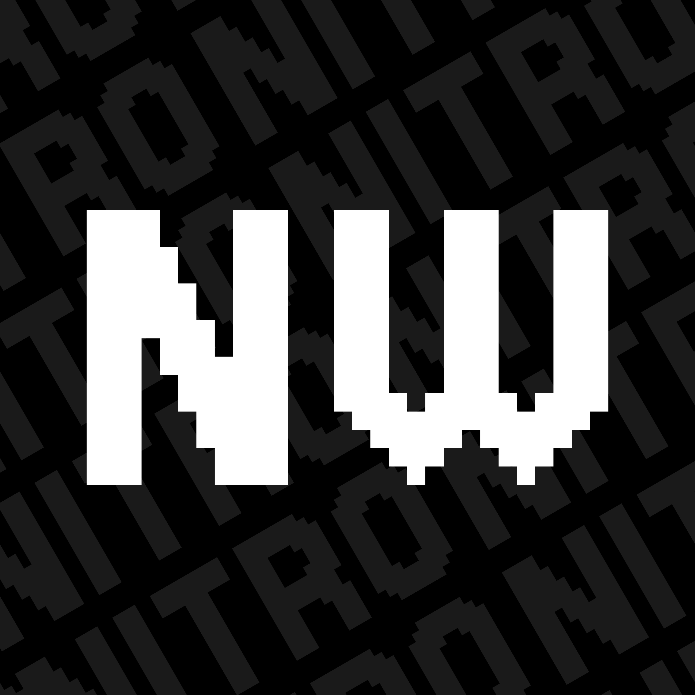

   

   <h1>NitroWin</h1>

   

      
      
      
   

## :white_check_mark: · Features

Here are some features compared to a stock Windows installation:

* :lock: - Better privacy
* :scissors: - Less bloat
* :rocket: - More FPS

Compared to other Windows modifications, NitroWin has:

* :shield: - No disabled security features
* :do_not_litter: - No custom branding
* :no_entry_sign: - No AME playbook

## :books: · How do I use this?

> [!IMPORTANT]
> Install the [.NET 8.0 Runtime](https://dotnet.microsoft.com/en-us/download/dotnet/8.0) if you haven't already. You only need the desktop or the normal runtime, not both.

Go to the [latest GitHub release page](https://github.com/Nitro4542/NitroWin/releases/latest) and download NitroWin.exe from there and run it.

Create a normal Windows 11 installation media as usual, but place the autounattend.xml file from the NitroWin folder and the folder itself generated by the NitroWin executable in the root of your installation media.

## :scroll: · License

This project is licensed under the [Unlicense](LICENSE).

It also contains files from different repositories, which are licensed under their individual licenses.

For more details, see [NOTICE.md](NOTICE.md).

### :wrench: · Tweaks

My tweaks are licensed under the [Zero-Clause-BSD license](https://github.com/Nitro4542/NitroWin.Tweaks/blob/main/LICENSE). But note that most tweaks that are used in this project were made by AtlasOS. Although they have been converted into a more standard format, I decided to keep the [GPL-3.0 license](https://github.com/Atlas-OS/Atlas/blob/main/LICENSE). For more details, check out the [NitroWin.Tweaks repository](https://github.com/Nitro4542/NitroWin.Tweaks).

### :heavy_exclamation_mark: · Disclaimer

This project is not affiliated with Microsoft or any other third-party project this repository uses.

This project does not distribute modified Windows ISOs.
