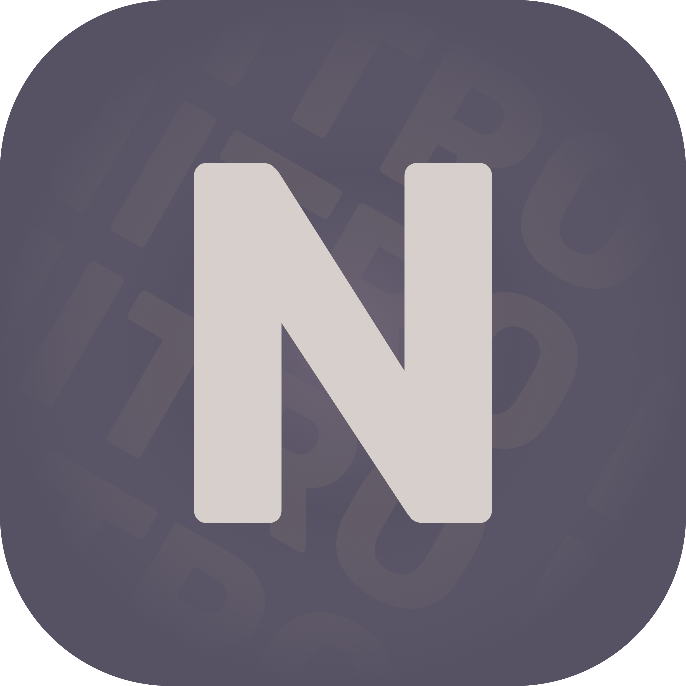

   

   <h1>NitroWin</h1>

   

      
      
      
   

## :white_check_mark: · Features

Here are some features compared to a stock Windows installation:

* :lock: - Better privacy
* :scissors: - Less bloat
* :rocket: - More FPS

Compared to other Windows modifications, NitroWin has:

* :shield: - No disabled security features
* :do_not_litter: - No custom branding
* :no_entry_sign: - No AME playbook

## :books: · How do I use this?

> [!IMPORTANT]
> Install the [.NET 8.0 Runtime](https://dotnet.microsoft.com/en-us/download/dotnet/8.0) if you haven't already. You only need the desktop or the normal runtime, not both.

Go to the [latest GitHub release page](https://github.com/Nitro4542/NitroWin/releases/latest) and download NitroWin.zip from there and extract it.

Create your Windows installation media as you usually would. Run the NitroWin executable and put in the drive letter of your installation media when prompted.

Open the new NitroWin folder in your installation media and open the Apps.txt file. Customize it to your liking, using [this guide](docs/config.md).

Install Windows as usual (Pro is recommended).

After installing Windows, run the NitroWin.Installer executable and accept all UAC prompts.

It is recommended to use WinUtil and OOSU after installing.

## :scroll: · License

This project is licensed under the [Zero-Clause-BSD license](LICENSE).

It also contains files from different repositories, which are licensed under their individual licenses.

For more details, see [NOTICE.md](NOTICE.md).

### :wrench: · Tweaks

My tweaks are licensed under the [Zero-Clause-BSD license](https://github.com/Nitro4542/NitroWin.Tweaks/blob/main/LICENSE). But note that most tweaks that are used in this project were made by AtlasOS. Although they have been converted into a more standard format, I decided to keep the [GPL-3.0 license](https://github.com/Atlas-OS/Atlas/blob/main/LICENSE). For more details, check out the [NitroWin.Tweaks repository](https://github.com/Nitro4542/NitroWin.Tweaks).

### :heavy_exclamation_mark: · Disclaimer

This project is not affiliated with Microsoft or any other third-party project this repository uses.

This project does not distribute modified Windows ISOs.
